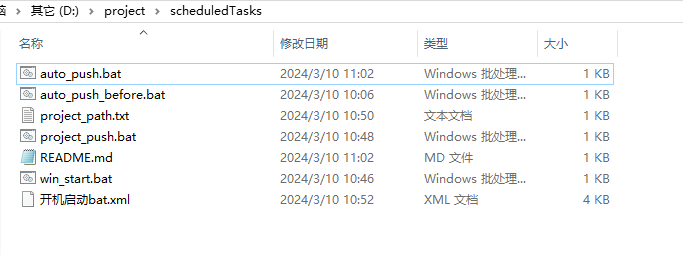
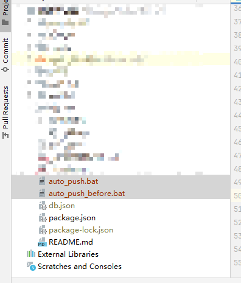
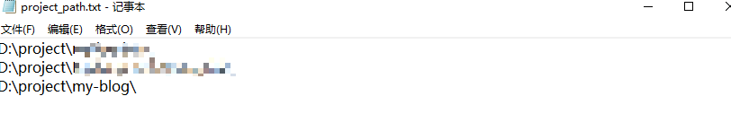

# win项目自动管理

## 功能

### 自动拉取

通过[win_start.bat](win_start.bat)脚本进行自动拉取远端代码，并合并

```shell
@echo off

echo "执行auto_push_before.bat"

for /f "tokens=*" %%a in (project_path.txt) do (
    echo "拉取项目" %%a
    start cmd /k %%a"auto_push_before.bat"
)

pause
```

### 开机拉取

通过导入任务计划[开机启动bat.xml](%BF%AA%BB%FA%C6%F4%B6%AFbat.xml)，再win启动时，进行自动运行[win_start.bat](win_start.bat)从而实现开机拉取项目

### 一键推送

再管理多个项目时，可能会忘记代码的推送。直接运行[project_push.bat](project_push.bat)脚本即可自动推送（脚本可以自己调整，进行构建等操作）

```shell
@echo off

echo "执行push auto_push.bat"

for /f "tokens=*" %%a in (project_path.txt) do (
    echo "推送项目" %%a
    start cmd /k %%a"auto_push.bat"
)

pause
```

## 使用说明

### 拉取本项目



### 复制脚本

将脚本[auto_push.bat](auto_push.bat)和[auto_push_before.bat](auto_push_before.bat)复制到自己项目路径下（和.git同一个层级）


### 添加项目地址

将你的项目地址添加到[project_path.txt](project_path.txt)中（必须\结尾，每个项目必须换行）



### 运行脚本测试

...

